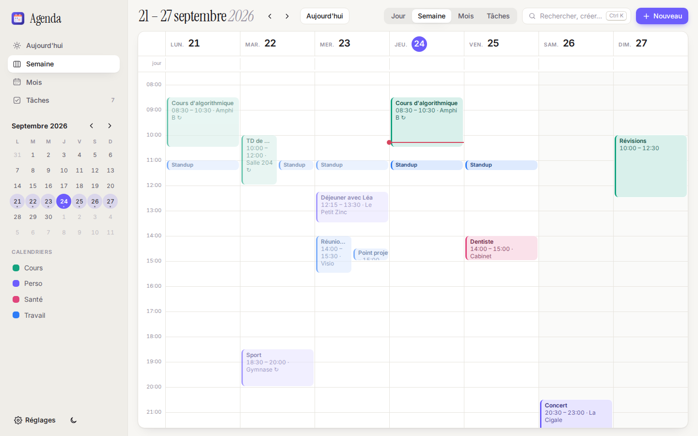
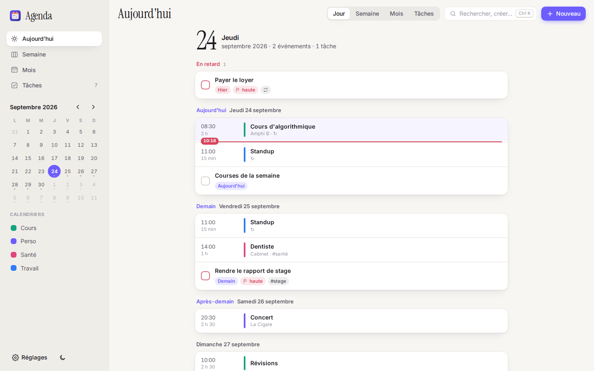
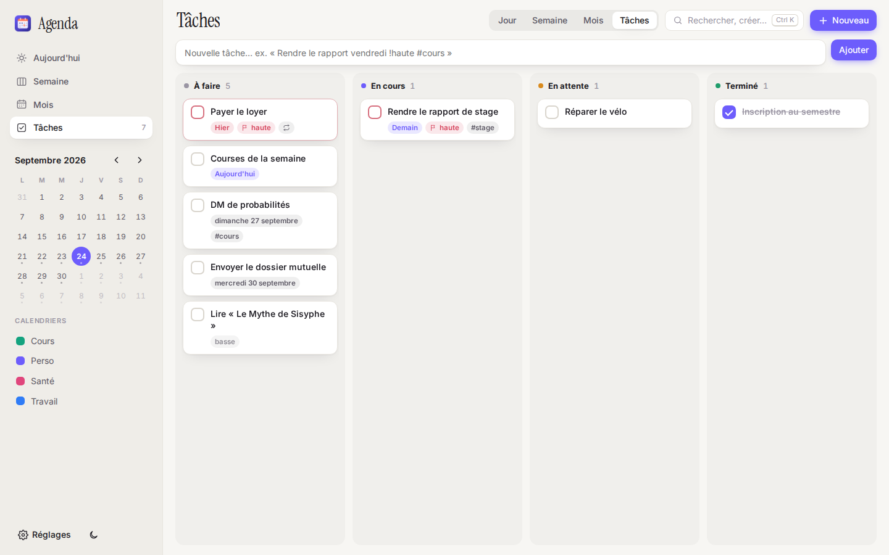
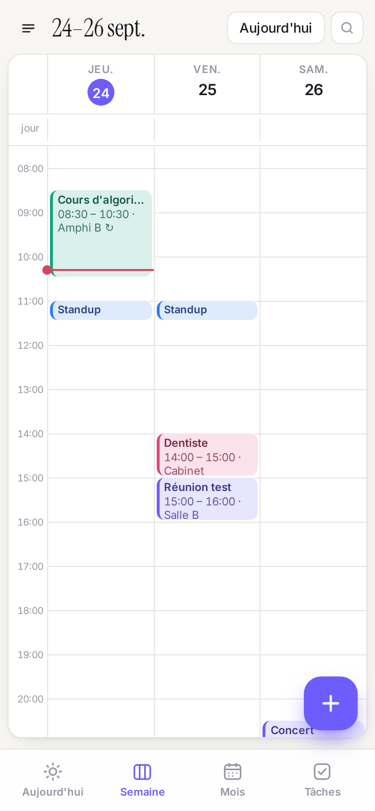
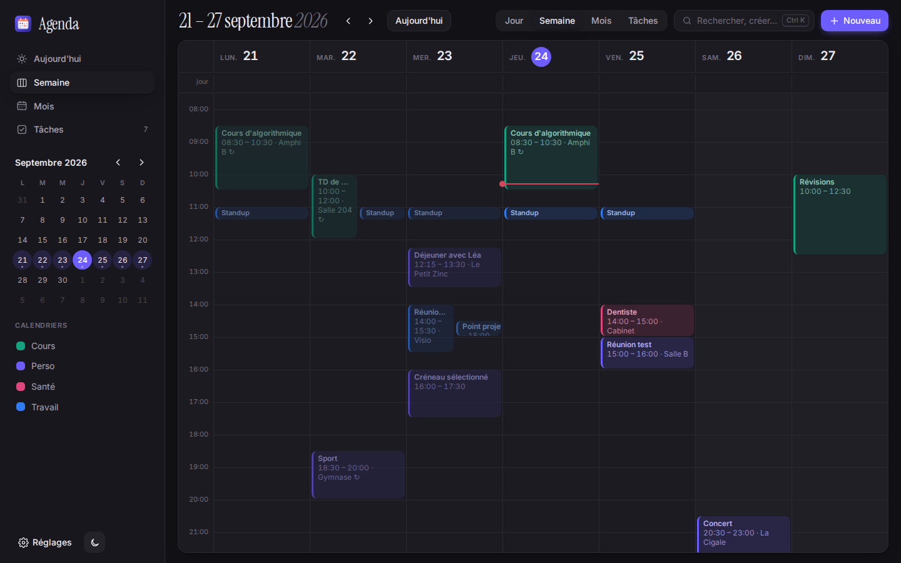

<p align="center"></p>

<h1 align="center">Agenda</h1>

<p align="center">Agenda et gestionnaire de tâches <b>local-first</b> :<br>
un dossier de fichiers Markdown synchronisé par Syncthing,<br>
une application soignée sur Linux, macOS et Android,<br>
et des outils pensés pour les agents IA.</p>

<p align="center">
<a href="https://github.com/hello-theojiang/test/releases/latest"></a>
<a href="LICENSE-MIT"></a>
</p>

<p align="center"><a href="INSTALLER.md"><b>Guide d'installation pas à pas</b></a> · <a href="docs/AGENDA.md">Format des fichiers</a> · <a href="docs/hermes-skill.md">Agents (MCP)</a> · <a href="https://github.com/hello-theojiang/test/releases/latest">Toutes les versions</a></p>

> 🇬🇧 *A French-language, local-first calendar & tasks app: a folder of Markdown+YAML
> files synced via Syncthing, a Tauri app for Linux/macOS/Android, and an MCP
> server so AI agents can read and edit your schedule. No account, no cloud.*

## Télécharger

Rien à compiler : tout est dans la [dernière Release](https://github.com/hello-theojiang/test/releases/latest).
Guide complet avec captures : [INSTALLER.md](INSTALLER.md).

| Appareil | Fichier | Installation |
|---|---|---|
| **Android** (arm64, armv7) | [`agenda.apk`](https://github.com/hello-theojiang/test/releases/latest/download/agenda.apk) | Ouvrir le fichier → autoriser l'installation → **Installer** |
| **Arch Linux** | [`PKGBUILD`](https://github.com/hello-theojiang/test/releases/latest/download/PKGBUILD) | `makepkg -si` (installe app + CLI + rappels) |
| **Linux (autres)** | [`.AppImage`](https://github.com/hello-theojiang/test/releases/latest/download/Agenda_amd64.AppImage) · [`.deb`](https://github.com/hello-theojiang/test/releases/latest/download/Agenda_amd64.deb) | `chmod +x` et lancer, ou installer le paquet |
| **macOS** (universel) | [`Agenda_universal.dmg`](https://github.com/hello-theojiang/test/releases/latest/download/Agenda_universal.dmg) | Clic droit → **Ouvrir** (app non signée Apple) |
| **CLI** (VPS, serveurs) | [Linux x86_64](https://github.com/hello-theojiang/test/releases/latest/download/agenda-linux-x86_64) · [aarch64](https://github.com/hello-theojiang/test/releases/latest/download/agenda-linux-aarch64) · [macOS](https://github.com/hello-theojiang/test/releases/latest/download/agenda-macos-arm64) | Binaire statique, aucune dépendance |
| Vérification | [`SHA256SUMS`](https://github.com/hello-theojiang/test/releases/latest/download/SHA256SUMS) | `sha256sum -c SHA256SUMS --ignore-missing` |

## Captures



| Mois | Aujourd'hui | Tâches |
|---|---|---|
|  |  |  |

| Téléphone | | | Thème sombre |
|---|---|---|---|
|  |  |  |  |

## Principe

La **source de vérité est un dossier** : un fichier Markdown par événement ou par
tâche, avec un en-tête YAML. Vous le synchronisez comme vous voulez (Syncthing) ;
les applications ne sont que des vues sur ce dossier. Aucun compte, aucun
serveur obligatoire.

```markdown
---
title: Sport
start: 2026-09-29 18:30
end: 2026-09-29 20:00
repeat: FREQ=WEEKLY;BYDAY=TU
location: Gymnase
tags: [sport]
alarm: [1h]
---
Penser à la gourde.
```

Formats standards : Markdown, YAML, RRULE et iCalendar. Les champs que
l'application ne connaît pas sont **conservés à l'octet près** ; rien n'est
jamais effacé (la corbeille est un dossier `.trash/`). Spécification complète :
[`docs/AGENDA.md`](docs/AGENDA.md).

## Fonctions

- **Vues** Jour (« Aujourd'hui »), Semaine, Mois et Tâches (colonnes par statut).
- **Saisie en français naturel**, avec aperçu avant validation :
  « Dentiste vendredi 14h-15h @Cabinet #santé », « Sport tous les mardis 18h30
  pendant 1h30 », « Rapport demain !haute », « Vacances du 20 au 24 octobre »,
  « Club le premier mardi du mois 20h »…
- **Palette de commandes** (`N`, `Ctrl K`, `/`) : créer, rechercher (insensible aux
  accents), lancer une commande.
- **Glisser-déposer** à la souris et au doigt (appui long) : déplacer,
  redimensionner, créer en sélectionnant un créneau. Chaque action s'annule
  (`Ctrl Z`), même entre deux lancements.
- **Modifications externes en direct** (Hermes, Syncthing, éditeur de texte) :
  fusion champ par champ qui n'écrase jamais un changement externe ; les conflits
  Syncthing sont signalés et se résolvent champ par champ dans l'application.
- **Répétitions** RRULE avec exceptions, fuseaux horaires, journées entières sur
  plusieurs jours.
- **iCalendar** : abonnements `.ics`/`webcal` en lecture seule, import, export,
  flux `/agenda.ics` servi par `agenda serve`.
- **Rappels** (`alarm: [15m, 1d]`, rappel par défaut par calendrier) : dans
  l'application, programmés dans Android (même application fermée), `agenda remind`
  sur le PC (notify-send, osascript) et sur le VPS (ntfy ou commande).
- **Pour les agents** : serveur MCP (`agenda mcp`), CLI avec `--json`,
  `agenda brief` (situation en ~500 tokens), [skill Hermes](docs/hermes-skill.md).
- **Esthétique** : thèmes clair et sombre, six couleurs d'accent, polices libres
  embarquées (Inter, Instrument Serif), animations sobres, interface pensée pour
  le téléphone.

## En ligne de commande

```sh
agenda add "Dentiste vendredi 14h-15h @Cabinet #santé"
agenda today                  # ou week, list --from 2026-10-01 --to 2026-10-31
agenda tasks
agenda done rapport           # un mot du titre suffit s'il est unique
agenda free --min 60 --day-start 17:00
agenda brief                  # résumé pour un humain ou un agent
agenda --json search "réunion"
agenda sub add feries webcal://exemple.org/feries.ics
agenda serve                  # interface web sur http://127.0.0.1:8421
agenda remind --ntfy https://ntfy.sh/agenda-CHANGEZ-MOI
agenda undo
```

## Architecture

```
crates/agenda-core   Rust standard, zéro dépendance : format, dates, fuseaux (TZif,
                     tzdata Android), RRULE, iCalendar, langage naturel, inotify.
                     Une seule API : Api::call(méthode, JSON) → JSON.
crates/agenda-cli    le binaire « agenda » : CLI, serve (HTTP), mcp (stdio), remind.
ui/                  HTML/CSS/JS sans framework ni étape de build ; la même interface
                     sert l'application et « agenda serve ».
app/src-tauri        enveloppe Tauri 2 (bureau + Android) qui délègue tout au cœur.
                     Les dépendances externes n'existent que là.
e2e/                 parcours Playwright contre « agenda serve ».
packaging/           PKGBUILD (-bin et sources), systemd, LaunchAgent, Release.
```

## Performances

Mesurées par `cargo run --release -p agenda-core --example bench` sur 6 000
fichiers (5 000 événements dont 100 répétés, 1 000 tâches) :

| Mesure | Résultat |
|---|---|
| Ouverture du dossier | ~35–44 ms |
| Calcul des occurrences d'un mois (1 088) | ~0,7 ms (appel API complet avec JSON : ~2,9 ms) |
| Recherche | ~5 ms |
| `brief` | ~1,1 ms |
| Langage naturel | ~25 µs |
| CLI statique (musl, interface web et polices incluses) | ~1,7 Mo |
| Mémoire du serveur `agenda serve` (musl) | ~8,5 Mo de RSS avec 6 000 fichiers chargés |
| Application de bureau (Linux) | ~5 Mo, WebView du système (pas de Chromium embarqué) |

## Construire depuis les sources

```sh
cargo test && cargo build --release -p agenda-cli           # CLI
cd app && npm ci && npx tauri build                          # application de bureau
cd e2e && npm ci && npx playwright install chromium && npx playwright test
```

La CI GitHub Actions compile et teste tout à chaque push (Linux, Arch, macOS
universel, APK Android arm64/armv7, Playwright) ; un tag `v*` ou un commit
contenant `[release]` publie une Release.

## Licence

MIT. Polices : Inter et Instrument Serif, SIL Open Font License 1.1
([`ui/fonts/LICENCES.txt`](ui/fonts/LICENCES.txt)).
